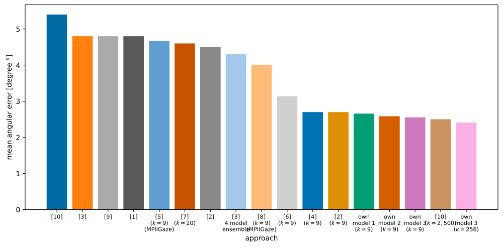
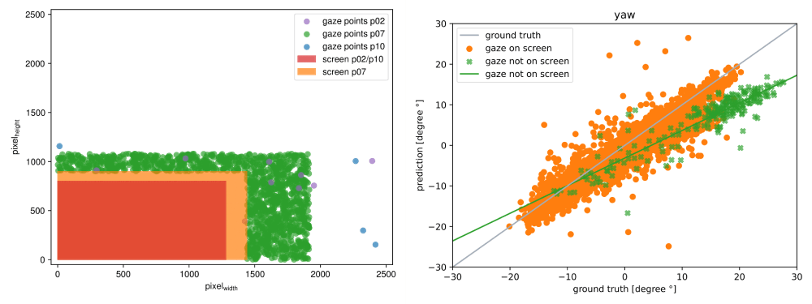
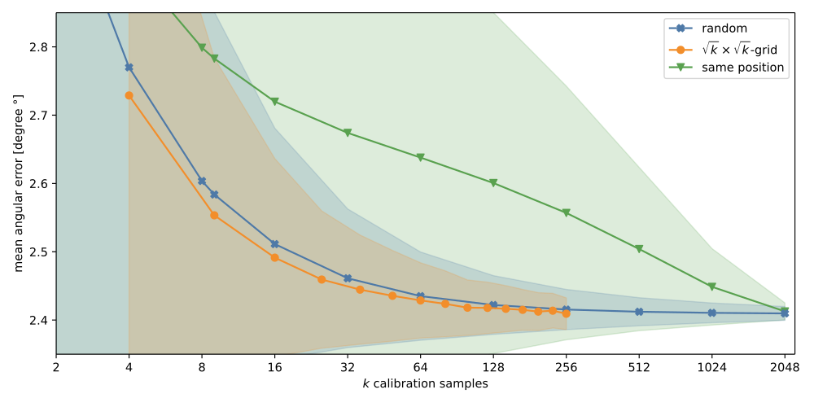

# Evaluation of a Monocular Eye Tracking Set-Up

As part of my master thesis, I implemented a new state-of-the-art model that is based on the work of [Chen et al.](https://doi.org/10.1109/WACV45572.2020.9093419). \
For 9 calibration samples, the previous state-of-the-art performance can be improved by up to 5.44% (2.553 degrees compared to 2.7 degrees) and for 128 calibration samples, by 7% (2.418 degrees compared to 2.6 degrees).
This is accomplished by (a) improving the extraction of eye features, (b) refining the  fusion process of these features, (c) removing erroneous data from the MPIIFaceGaze dataset during training, and (d) optimizing the calibration method.

A software to [collect own gaze data](https://github.com/pperle/gaze-data-collection) and the [full gaze tracking pipeline](https://github.com/pperle/gaze-tracking-pipeline) is also available.

For the citaitions [1] - [10] please see below. "own model 1" represents the model described in the section below.
"own model 2" uses the same model architecture as "own model 1" but is trained without the erroneous data, see MPIIFaceGaze section below. 
"own model 3" is the same as "own model 2" but with the calibrations points organized in a $\sqrt{k}\times\sqrt{k}$ grid instead of randomly on the screen.

## Model
Since the feature extractors share the same weights for both eyes, it has been shown experimentally that the feature extraction process can be improved by flipping one of the eye images so that the noses of all eye images are on the same side.
The main reason for this is that the images of the two eyes are more similar this way and the feature extractor can focus more on the relevant features, rather than the unimportant features, of either the left or the right eye.

The architectural improvement that has had the most impact is the improved feature fusion process of left and right eye features.
Instead of simply combining the two features, they are combined using Squeeze-and-Excitation (SE) blocks.
This introduces a control mechanism for the channel relationships of the extracted feature maps that the model can learn serially.

Start training by running `python train.py --path_to_data=./data --validate_on_person=1 --test_on_person=0`.
For pretrained models, please see evaluation section.

## Data
While examining and analyzing the most commonly used gaze prediction dataset, [MPIIFaceGaze](https://www.perceptualui.org/research/datasets/MPIIFaceGaze/) a subset of [MPIIGaze](https://www.mpi-inf.mpg.de/departments/computer-vision-and-machine-learning/research/gaze-based-human-computer-interaction/appearance-based-gaze-estimation-in-the-wild/), in detail.
It was realized that some recorded data does not match the provided screen sizes. 
For participant 2, 7, and 10, 0.043%, 8.79%, and 0.39% of the gazes directed at the screen did not match the screen provided, respectively.
The left figure below shows recorded points in the datasets that do not match the provided screen size. 
These false target gaze positions are also visible in the right figure below, where the gaze point that are not on the screen have a different yaw offset to the ground truth.

To the best of our knowledge, we are the first to address this problem of this widespread dataset, and we propose to remove all days with any errors for people 2, 7, and 10, resulting in a new dataset we call MPIIFaceGaze-.
This would only reduce the dataset by about 3.2%. As shown in the first figure, see "own model 2", removing these erroneous data improves the model's overall performance.

For preprocessing MPIIFaceGaze, [download](https://www.perceptualui.org/research/datasets/MPIIFaceGaze/) the original dataset and then
run `python dataset/mpii_face_gaze_preprocessing.py --input_path=./MPIIFaceGaze --output_path=./data`.
Or [download the preprocessed dataset](https://drive.google.com/uc?export=download&id=1eCdULbgtJKmZPRrLoBtIS1mw_IQwH6Zi).

To only generate the CSV files with all filenames which gaze is not on the screen, run `python dataset/mpii_face_gaze_errors.py --input_path=./MPIIFaceGaze --output_path=./data`.
This can be run on MPIIGaze and MPIIFaceGaze, or the CSV files can be directly downloaded for [MPIIGaze](https://drive.google.com/file/d/1buUCPO0xluVxYxN4FwnupNDP3mpZ3SiN/view?usp=sharing) and [MPIIFaceGaze](https://drive.google.com/file/d/1Cq25df9124q8vkdsJO1BiqjuLSWlXz1r/view?usp=sharing).

## Calibration
Nine calibration samples has become the norm for the comparison of different model architectures using MPIIFaceGaze.
When the calibration points are organized in a  $\sqrt{k}\times\sqrt{k}$ grid instead of randomly on the screen, or all in one position, the resulting person-specific calibration is more accurate.
The three different ways to distribute the calibration point are compared in the figure below, also see "own model 3" in the first figure.
Nine calibration samples aligned in a grid result in a lower angular error than 9 randomly positioned calibration samples.

To collect your own calibration data or dataset, please refer to [gaze data collection](https://github.com/pperle/gaze-data-collection).

## Evaluation
For evaluation, the trained models are evaluated on the full MPIIFaceGaze, including the erroneous data, for a fair comparison to other approaches.
Download the [pretrained "own model 2" models](https://drive.google.com/drive/folders/1-_bOyMgAQmnwRGfQ4QIQk7hrin0Mexch?usp=sharing) and
run `python eval.py --path_to_checkpoints=./pretrained_models --path_to_data=./data` to reproduce the results shown in the figure above and the table below. 
`--grid_calibration_samples=True` takes a long time to evaluate, for the ease of use the number of calibration runs is reduced to 500.

|  | random calibration k=9 | random calibration k=128 | grid calibration k=9 | grid calibration k=128 |   k=all |
|---|---:|---:|---:|---:|---:|
| **p00** | 1.780 | 1.676 | 1.760 | 1.674 | 1.668 |
| **p01** | 1.899 | 1.777 | 1.893 | 1.769 | 1.767 |
| **p02** | 1.910 | 1.790 | 1.875 | 1.787 | 1.780 |
| **p03** | 2.924 | 2.729 | 2.929 | 2.712 | 2.714 |
| **p04** | 2.355 | 2.239 | 2.346 | 2.229 | 2.229 |
| **p05** | 1.836 | 1.720 | 1.826 | 1.721 | 1.711 |
| **p06** | 2.569 | 2.464 | 2.596 | 2.460 | 2.455 |
| **p07** | 3.823 | 3.599 | 3.737 | 3.562 | 3.582 |
| **p08** | 3.778 | 3.508 | 3.637 | 3.501 | 3.484 |
| **p09** | 2.695 | 2.528 | 2.667 | 2.526 | 2.515 |
| **p10** | 3.241 | 3.126 | 3.199 | 3.105 | 3.118 |
| **p11** | 2.668 | 2.535 | 2.667 | 2.536 | 2.524 |
| **p12** | 2.204 | 1.877 | 2.131 | 1.882 | 1.848 |
| **p13** | 2.914 | 2.753 | 2.859 | 2.754 | 2.741 |
| **p14** | 2.161 | 2.010 | 2.172 | 2.052 | 1.998 |
| **mean** | **2.584** | **2.422** | **2.553** | **2.418** | **2.409** |

## Bibliography
[1] Zhaokang Chen and Bertram E. Shi, “Appearance-based gaze estimation using dilated-convolutions”, Lecture Notes in Computer Science, vol. 11366, C. V. Jawahar, Hongdong Li, Greg Mori, and Konrad Schindler, Eds., pp. 309–324, 2018. DOI: 10.1007/978-3-030-20876-9_20. [Online]. Available: https://doi.org/10.1007/978-3-030-20876-9_20. \
[2] ——, “Offset calibration for appearance-based gaze estimation via gaze decomposition”, in IEEE Winter Conference on Applications of Computer Vision, WACV 2020, Snowmass Village, CO, USA, March 1-5, 2020, IEEE, 2020, pp. 259–268. DOI: 10.1109/WACV45572.2020.9093419. [Online]. Available: https://doi.org/10.1109/WACV45572.2020.9093419. \
[3] Tobias Fischer, Hyung Jin Chang, and Yiannis Demiris, “RT-GENE: real-time eye gaze estimation in natural environments”, in Computer Vision - ECCV 2018 - 15th European Conference, Munich, Germany, September 8-14, 2018, Proceedings, Part X, Vittorio Ferrari, Martial Hebert, Cristian Sminchisescu, and Yair Weiss, Eds., ser. Lecture Notes in Computer Science, vol. 11214, Springer, 2018, pp. 339–357. DOI: 10.1007/978-3-030-01249-6_21. [Online]. Available: https://doi.org/10.1007/978-3-030-01249-6_21. \
[4] Erik Lindén, Jonas Sjöstrand, and Alexandre Proutière, “Learning to personalize in appearance-based gaze tracking”, pp. 1140–1148, 2019. DOI: 10.1109/ICCVW.2019.00145. [Online]. Available: https://doi.org/10.1109/ICCVW.2019.00145.  \
[5] Gang Liu, Yu Yu, Kenneth Alberto Funes Mora, and Jean-Marc Odobez, “A differential approach for gaze estimation with calibration”, in British Machine Vision Conference 2018, BMVC 2018, Newcastle, UK, September 3-6, 2018, BMVA Press, 2018, p. 235. [Online]. Available: http://bmvc2018.org/contents/papers/0792.pdf. \
[6] Seonwook Park, Shalini De Mello, Pavlo Molchanov, Umar Iqbal, Otmar Hilliges, and Jan Kautz, “Few-shot adaptive gaze estimation”, pp. 9367–9376, 2019. DOI: 10.1109/ICCV.2019.00946. [Online]. Available: https://doi.org/10.1109/ICCV.2019.00946. \
[7] Seonwook Park, Xucong Zhang, Andreas Bulling, and Otmar Hilliges, “Learning to find eye region landmarks for remote gaze estimation in unconstrained settings”, Bonita Sharif and Krzysztof Krejtz, Eds., 21:1–21:10, 2018. DOI: 10.1145/3204493.3204545. [Online]. Available: https://doi.org/10.1145/3204493.3204545. \
[8] Yu Yu, Gang Liu, and Jean-Marc Odobez, “Improving few-shot user-specific gaze adaptation via gaze redirection synthesis”, pp. 11 937–11 946, 2019. DOI: 10.1109/CVPR.2019.01221. [Online]. Available: http://openaccess.thecvf.com/content_CVPR_2019/html/Yu_Improving_Few-Shot_User-Specific_Gaze_Adaptation_via_Gaze_Redirection_Synthesis_CVPR_2019_paper.html. \
[9] Xucong Zhang, Yusuke Sugano, Mario Fritz, and Andreas Bulling, “It’s written all over your face: Full-face appearance-based gaze estimation”, pp. 2299–2308, 2017. DOI: 10.1109/CVPRW.2017.284. [Online]. Available: https://doi.org/10.1109/CVPRW.2017.284 \
[10] ——, “Mpiigaze: Real-world dataset and deep appearance-based gaze estimation”, IEEE Trans. Pattern Anal. Mach. Intell., vol. 41, no. 1, pp. 162–175, 2019. DOI: 10.1109/TPAMI.2017.2778103. [Online]. Available: https://doi.org/10.1109/TPAMI.2017.2778103. \
